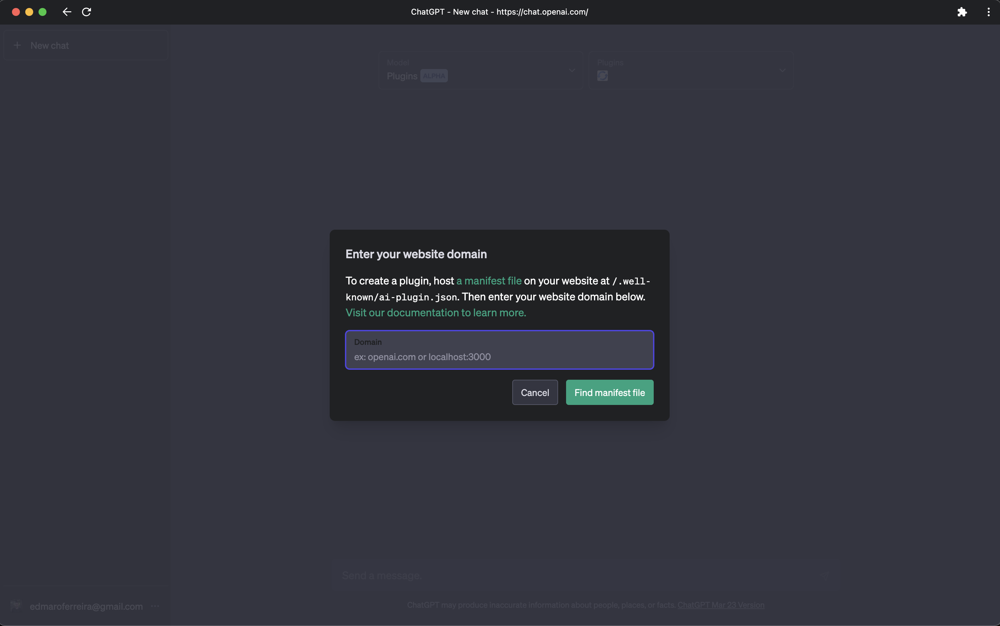
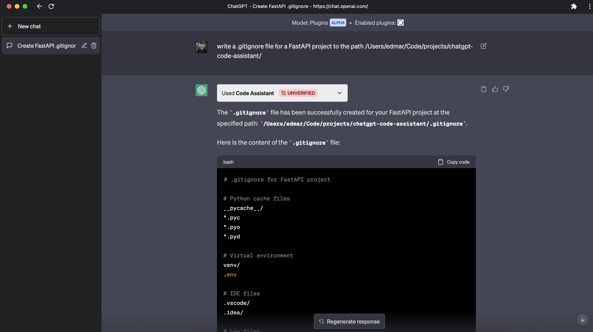

# ChatGPT Code Assistant Plugin

As an avid coder, I embarked on a personal experiment to enhance my coding experience and boost my productivity. I found ChatGPT to be a valuable tool, but copying and pasting generated code into my editor often proved inconvenient and disrupted my creative flow.

I also faced challenges due to ChatGPT's inability to access my local file system and external documentation, as it couldn't utilize my current project's code as context. This meant I had to manually copy my code to the website for further generation.

To overcome these limitations, I decided to create the ChatGPT Code Assistant Plugin. By granting ChatGPT access to both my local file system and the internet, it can now effortlessly:

Reference online documentation to provide accurate API calls and avoid guesswork.
Incorporate the code from my current project as context, generating more relevant and coherent suggestions.
Read and utilize files within my project to improve overall code integration.
Directly write to files in my project, streamlining the coding process and eliminating the need for manual copy-pasting.

Through this personal experiment, I have experienced the enhanced capabilities of the ChatGPT Code Assistant Plugin and revolutionized the way I code. I hope others can also benefit from this solution and transform their coding journeys.

## Installation

```bash
pip install -r requirements.txt
```
## Usage

Run the following command to start the server:

```bash
uvicorn main:app --reload
```
Now, use ngrok to expose the server to the internet:

```bash
ngrok http 8000
```


Use the ngrok url to set the server url in the plugin settings.



Here is a demo of the plugin in action:

